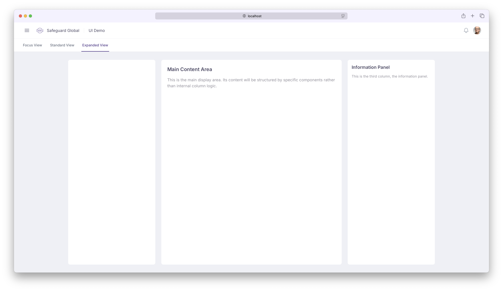

# Safeguard Global - Design System Prototype

This project is a prototype for the Safeguard Global design system, showcasing a collection of reusable UI components.

The primary goal of this prototype is to:
- Demonstrate the visual style and interaction patterns of the design system.
- Provide a set of foundational components that can be further developed and integrated into various Safeguard Global applications.
- Explore modern front-end technologies and best practices for building a scalable and maintainable component library.

## Components Implemented

Currently, the prototype includes components such as:
- Navbar with branding, user profile, and notification icon.
- Tabbed interface for different layout views (Focus, Standard, Expanded).
- Slide-over panels for main navigation (from left) and notifications (from right).
- Basic column layouts for content display.
- Custom theme setup (colors, fonts, typography) using Tailwind CSS v4.

## Screenshot



## Tech Stack

- React
- Tailwind CSS v4.x
- Headless UI
- Vite

## Getting Started

To run this prototype locally:

1.  **Clone the repository (if applicable).**
2.  **Install dependencies:**
    ```bash
    npm install
    ```
3.  **Run the development server:**
    ```bash
    npm run dev
    ```
    This will typically start the application on `http://localhost:5173` (or another port if 5173 is in use).

## Further Development

This prototype serves as a starting point. Future work could include:
- Adding more complex components (forms, tables, modals, etc.).
- Writing comprehensive documentation and usage examples for each component.
- Implementing unit and integration tests.
- Setting up a build process for distributing the component library. 